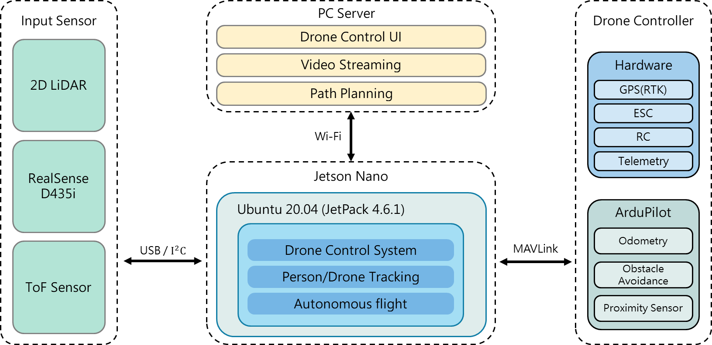
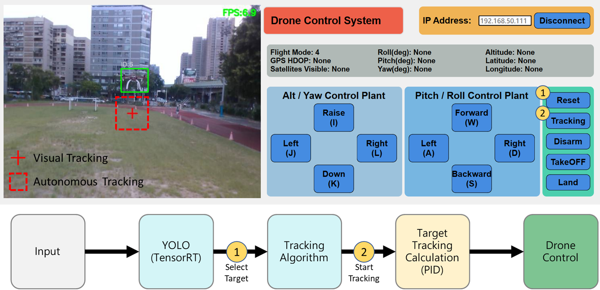

# Drone-Tracking-AIOT-LAB

A research-oriented platform for real‑time human target detection, multi-object identity tracking, and autonomous MAV (Micro Aerial Vehicle) control using Ultralytics YOLO + BoT‑SORT (ReID) and MAVLink. This repository accompanies (or is derived from) the associated paper (see Citation section). The code integrates onboard perception, low-latency streaming, target selection, PID-based auto pursuit, and mixed manual/autonomous control.

---
## 1. Key Contributions
- Unified pipeline: detection, multi-ID association (BoT-SORT + ReID), target locking, auto pursuit.
- Robust target retention: selective track forwarding + event-based lost-target recovery.
- Cross-layer communication design: single multiplexed TCP stream (VIDEO + META + EVENT) + dual UDP channels (telemetry / control) + MAVLink hub bridging serial & multiple peers.
- Modular AutoTrackController with tunable PID domains (vx, vz, yaw_rate) + lock box & dead-zones for stability.
- Asynchronous, non-blocking architecture (asyncio + threaded receiver) minimizing control loop jitter.

---
## 2. System Overview


---
## 3. Demo Video

### (1) Drone Tracker Compare Demo
[](https://youtu.be/JU0Ht4I6_2k "Drone Tracker Compare Demo")

### (2) System Tracking (Person / Drone) Demo
[](https://youtu.be/TBSe7B-PBjM "System Tracking (Person / Drone) Demo")

---
## 4. Datasets (Drone)

We constructed a dataset comprising 2,850 synthetic samples and 5,481 real samples sourced from publicly available datasets. For retraining the object detection model, the training set included 5,904 samples (3,912 real and 1,992 synthetic), while the validation set contained 2,427 samples (1,569 real and 858 synthetic). The complete dataset is publicly accessible:

[Drone Dataset (Roboflow)](https://universe.roboflow.com/aiotlab-lnkrh/mix_v005-z2ksj/dataset/2)

---
## 5. UI & Processing Pipeline


Figure: Control UI & Tracking Workflow

---
## 6. Repository Structure
```
Drone-Tracking-AIOT-LAB/
  Drone/
    Main_Drone.py                 # Core server runtime
    config.py                     # IP, model, hub settings
    mav_function.py               # MAVLink command helpers
    Mavlink_UDP_hub.py            # Serial <-> multi-UDP relay
    drone_autotrack_controller.py # PID + auto pursuit logic
    model/                        # .engine / .pt / yaml artifacts
  UI_control/
    Main_UI.py                       # Ground GUI entry
    video_widget.py               # TCP receiver + overlay + selection
    message_widget.py             # Telemetry display (UDP)
    control_widget.py             # Manual + auto tracking controls
    Widge_Component.py            # Shared UI elements
    no_videos_available.jpg       # Placeholder frame
```

---
## 7. Dependencies
| Category | Packages |
|----------|----------|
| Core Vision | ultralytics, opencv-python, numpy |
| Control / MAV | pymavlink, pyserial |
| GUI | PyQt6, qasync |
| Async / Stdlib | asyncio, json, csv, struct, time |

Install (example):
```
pip install --upgrade pip
pip install ultralytics opencv-python numpy pymavlink pyserial PyQt6 qasync
```
(Optional) Add TensorRT runtime if deploying `.engine` models.

---
## 8. Configuration (`Drone/config.py`)
```
HOST_IP = "<DRONE_SBC_IP>"    # Bound + source for UDP services
PC_IP   = "<GROUND_PC_IP>"     # Destination for TCP video
MODEL   = "Drone" # Base name (tries <name>_<imgsz>.engine etc.)
TRT_IMGSZ = 512
```

---
## 9. Running the System
### 9.1 Onboard Side
```
cd Drone
python Main_Drone.py
```
Wait for: `Initial Server OK`, `YOLO tracker ready.`

### 9.2 Ground GUI
```
cd UI_control
python Main_UI.py
```
Enter `HOST_IP` → Connect.

---
## 10. Target Selection & Auto Tracking Workflow
1. Press Select (enter selection mode — overlay prompts).
2. Click a bounding box → GUI emits `SelectID:<id>`.
3. Server locks ID (`tracking_flag=True`).
4. Start Tracking → enables PID auto pursuit (`AutoTracking_flag=True`).
5. Loss detection → EVENT issued; GUI re-enters selection mode.
6. Reset Selection → clears ID & stops auto mode.

---
## 12. Safety Notice
Autonomous velocity control can induce unsafe states:
- Always maintain manual RC override.
- Test PIDs at low altitude first.
- Avoid operation near people, reflective glass, or GPS-denied cluttered interiors.
- Log every flight session for traceability.
